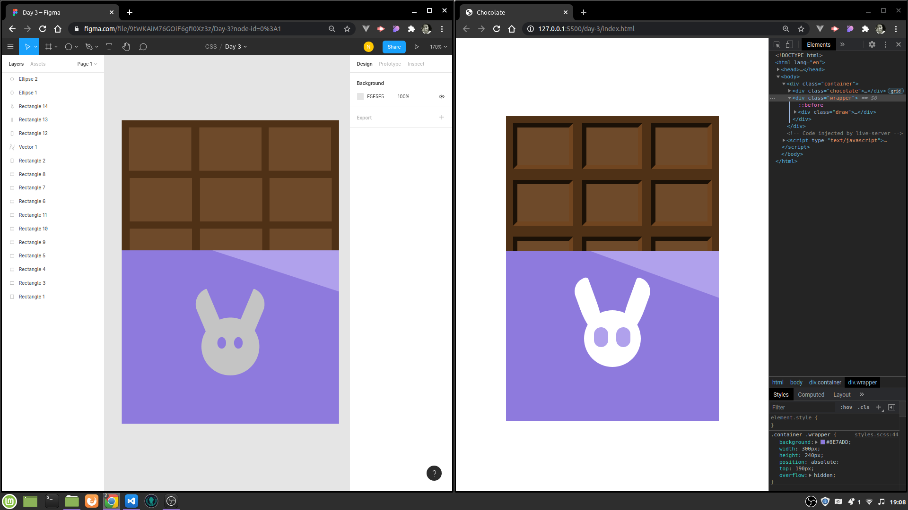

# # Dia 3 - Criando desenho no Figma e passando para CSS

Duração: cerca de 30 minutos

Quantidade de divs: 15

## Preview

    
    
(Esquerda: desenho feito no Figma. Direita: Desenho em CSS com esse alienzinho aí que inicialmente era para ser um coelho haha)

